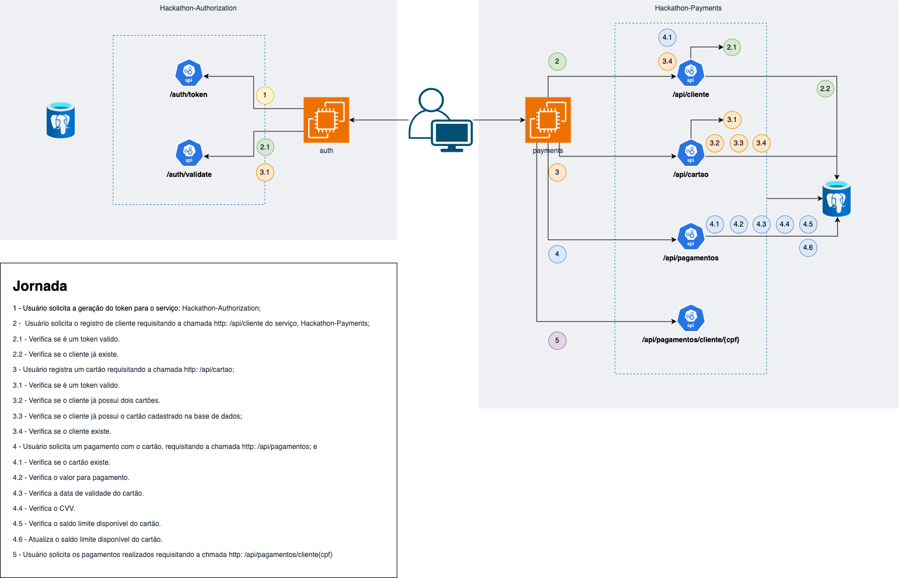

# Microserviço de Autenticação de Login - `bffecommerce`

## Visão Geral

- Objetivo: Este repositório contém o bffecommerce para uma aplicação de e-commerce. O serviço
  permite que clientes se cadastrem e façam login na plataforma, adicionem produtos ao carrinho e finalizem a compra.

- Arquitetura: O projeto foi desenvolvido em Java com Spring Boot, seguindo o padrão de arquitetura limpa. A aplicação
  é dividida em camadas de aplicação, domínio e infraestrutura.

- Segurança: A segurança da aplicação é garantida por meio de tokens JWT (JSON Web Token), que são gerados e validados

- Banco de Dados: Para facilitar o desenvolvimento e testes, a aplicação utiliza o banco de dados H2, que é um banco de
  dados em memória.

- Dependências: O projeto utiliza o Gradle como gerenciador de dependências e build.

- Requisitos: Para executar o projeto, é necessário ter o JDK 17 ou superior e o Gradle 6.8 ou superior instalados na
  máquina e executar todos os microserviços necessários.

## Estrutura do Projeto

A estrutura do projeto está organizada em diferentes pacotes, cada um com responsabilidades específicas para manter o
código modular e fácil de manter.

| Pacote            | Descrição                | Responsabilidades                                                                                                          |
|-------------------|--------------------------|----------------------------------------------------------------------------------------------------------------------------|
| `/application`    | Camada de Aplicação      | Contém os serviços e controladores responsáveis pelo processamento das solicitações e pela lógica de negócio.              |
| `/domain`         | Camada de Domínio        | Define as entidades do domínio, repositórios e regras de negócio que regem o comportamento do sistema.                     |
| `/infrastructure` | Camada de Infraestrutura | Gerencia a comunicação com sistemas externos, como bancos de dados e serviços externos, e configurações de infraestrutura. |
| `/repository`     | Camada de Repositório    | Responsável por acessar o banco de dados e realizar operações de leitura e gravação.                                       |

## Arquitetura



## Sobre o Projeto

O projeto é um serviço de backend que realiza o cadastro de cliente, cartao e pagamentos.

### Funcionalidades

- Registro de cliente
- Registro de cartão
- Registro de pagamento
- Listagem de clientes
- Listagem de cartões
- Listagem de pagamentos

O serviço se comunica com o microserviço de autenticação de usuários para validar o token JWT e autorizar as solicitações


## Instruções de Uso

### Configuração Inicial

1. Clone o repositório do projeto:
    ```bash
    git clone https://github.com/emerlopes/hackathon-payments.git
    ```

2. Navegue até o diretório do projeto:
    ```bash
    cd hackathon-payments
    ```

3. Execute o `docker-compose` para iniciar os serviços:

- Certifique-se de que o Docker está instalado e em execução na sua máquina.
- Abra um terminal e navegue até o diretório do projeto.
- Execute o comando abaixo para baixar as imagens necessárias:
    ```bash
    docker-compose -f misc/docker-compose.yml pull
    ```
- Ainda no terminal, execute o seguinte comando para iniciar os serviços em segundo plano:
    ```bash
    docker-compose -f misc/docker-compose.yml up -d
    ```

## Repositórios Relacionados

1. [Microserviço de Autenticação - `hackathonauth`](https://github.com/emerlopes/hackathonauth)

- Exemplo de Requisição: Para facilitar a chamada das requisições, a collection da API pode ser encontrada no diretório
  `misc/collection`.

## Endpoints

Os detalhes dos endpoints da API, incluindo descrições, parâmetros de entrada e exemplos de resposta, estão disponíveis
em [`http://localhost:8080/swagger-ui/index.html#/`](http://localhost:8080/swagger-ui/index.html#/), após a execução do projeto e também em [`http://localhost:8081/swagger-ui/index.html#/`](http://localhost:8081/swagger-ui/index.html#/) 

